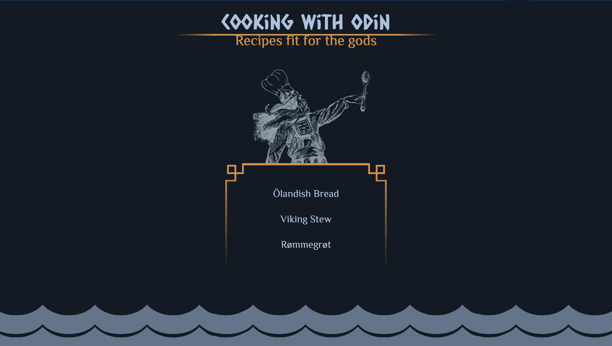
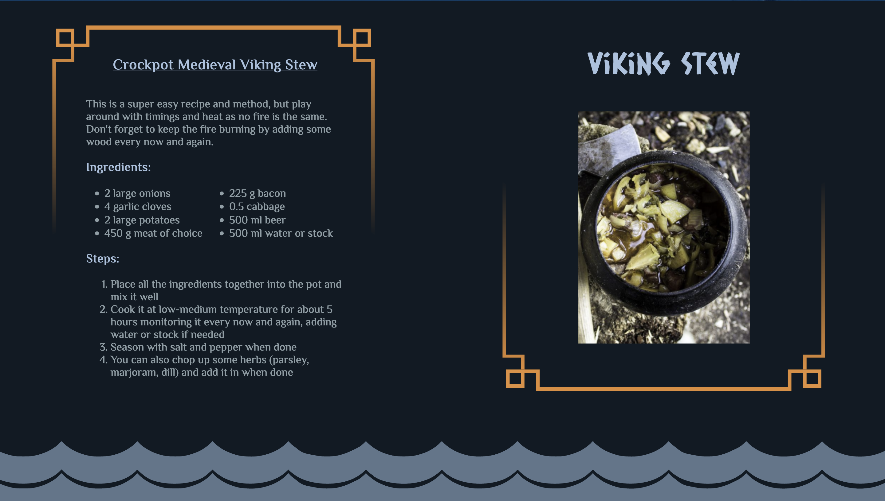

## **Project: Recipes**

### The Odin Project | Foundations Course

#### :stew: A simple recipe page to practice HTML and CSS

#### :thought_balloon: My goal was to create a viking/odin theme

#### :beers: Hope you enjoy!

  

  

## Links

#### :link: View the full website [here](https://simplenough.github.io/odin-recipes/)

#### :link: View the full assignment [here](https://www.theodinproject.com/lessons/foundations-recipes)
